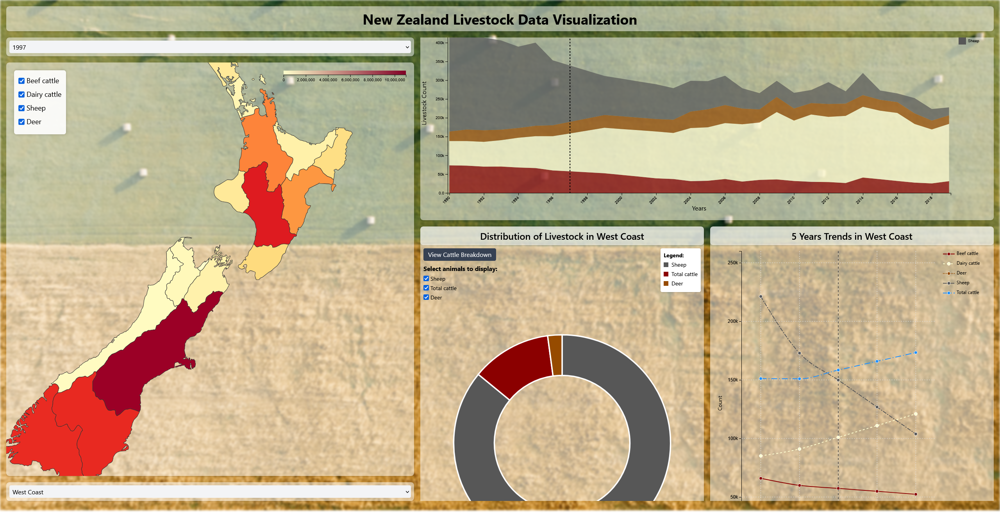

# New Zealand Livestock Data Visualization System

## Accessing Figma Files and Youtube
To access our youtube video and figma files for this project,\
Youtube:\
Figma:

## How to run it 
After you clone the repository, you need to download Node.js and npm from [nodejs.org](https://nodejs.org/en/download) if you don't have them installed. Once downloaded, restart your PC and check the version in the terminal.\
Navigate to the livestock_visualisation directory, run npm install and then npm run dev. A HTTP link will appear in the terminal - click it to open the application.

## Background
Our Information Visualisation system provides intuitive exploration of New Zealand's livestock data using React and D3.js. Designed for farmers, policymakers, researchers, investors, and environmental groups, it transforms complex data into actionable insights while ensuring optimal performance across devices.

## Key Features
### Interactive Choropleth Map
- Geographic distribution of livestock with color-coded regions
- Dynamic filtering by livestock type (beef/dairy cattle, sheep, deer)
- Detailed tooltips on hover

### Dual-Mode Trend Visualization
- Toggleable Area/Scatter plots showing historical patterns
- Long-term trend analysis with livestock type differentiation
- Helps correlate livestock trends with policy and economic factors

### Interactive Donut Chart
- At-a-glance livestock distribution summary
- Category filtering with instant visual updates
- Toggle between total cattle view and beef/dairy breakdown

### Detailed Line Chart
- Focused 5-year timeline for immediate trend analysis
- Clear visualization of annual changes in livestock numbers
- Supports benchmarking and short-term impact assessment

### Technical Highlights
- Modular React architecture with D3.js visualizations
- Responsive design for desktop and mobile use
- Interconnected visualizations providing complementary insights